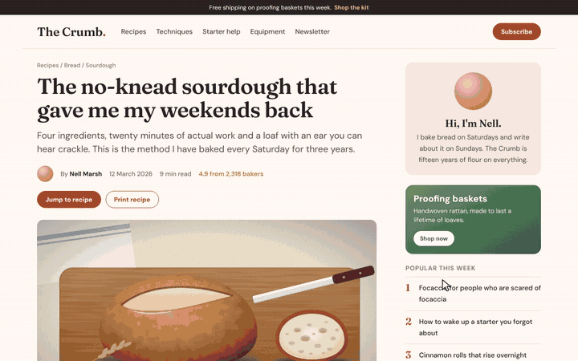

<p align="center">
  <a href="https://shmidtqq65.github.io/rugpull/">
    <picture>
      <source srcset="assets/demo.webp" type="image/webp">
      
    </picture>
  </a>
</p>

<h1 align="center">RUGPULL</h1>

<p align="center"><b>Every website is a memecoin now.</b></p>

<p align="center">
Launch any page as a coin. Click its words to buy them, then press <kbd>R</kbd> to pull the rug<br>
and watch the whole page fall into a pile. Press <kbd>Esc</kbd> for a full refund.
</p>

<p align="center">
  <a href="https://shmidtqq65.github.io/rugpull/"><b>Try it now</b></a>
  &nbsp;·&nbsp;
  <a href="#install">Install</a>
  &nbsp;·&nbsp;
  <a href="#controls">Controls</a>
  &nbsp;·&nbsp;
  <a href="#how-it-works">How it works</a>
</p>

<p align="center">
  
  
  
  
</p>

---

> **A parody.** There is no coin, no token, no wallet, no chain and no server. The market, the buyers and the crash are made up in your tab out of the page itself. Nothing leaves your browser, and nothing here is financial advice.

## What it does

- **The launch.** The page gets a ticker from its own name: The Crumb becomes `$CRUMB`, `the.internet` becomes `$INTERNET`, and a name too long for a ticker keeps its initials or loses its vowels (`news.ycombinator.com` trades as `$YCMBNTR`). A trading panel slides in with the price, candles, market cap, holders, volume, liquidity, a bonding curve and a live feed of trades. A ticker tape runs along the top with the page's own words as coins.
- **Buying.** Click any word on the page to buy it: it lights up in gold and a receipt floats up. The crowd buys too. Their words light up in green, and every buyer in the feed is named after a word from the page, like `sourdough.eth` or `degenflour`.
- **The rug.** Press <kbd>R</kbd>, hit the red button, or just wait: when the bonding curve reaches 100%, the dev pulls the rug for you. The price drops more than 99% in half a second, the dead cat bounces once, the screen shakes, and every word, picture and coloured box on the page falls to the bottom of the screen in a pile. Big pictures sink, words pile up on top.
- **The card.** A card with the damage comes up: the drop, the all-time high, the holders left holding the bag, what you bought and what the dev walked away with. Press <kbd>S</kbd> to save it as a PNG and post it.
- **The refund.** Press <kbd>Esc</kbd> and the pile flies back into place piece by piece. The page is switched back on exactly as it was.

## Install

Pick whichever fits. All four run the same single file.

### 1. Bookmarklet (Chrome, Edge, Safari, Firefox, Arc, Brave)

1. Open the [demo page](https://shmidtqq65.github.io/rugpull/).
2. Drag the dashed **RUGPULL** button into your bookmarks bar. No bar? <kbd>Ctrl</kbd>+<kbd>Shift</kbd>+<kbd>B</kbd>, or <kbd>⌘</kbd>+<kbd>Shift</kbd>+<kbd>B</kbd> on a Mac.
3. Open any website and click the bookmark. Click it again (or press <kbd>Esc</kbd>) to close it.

GitHub can't render `javascript:` links in a README, so the button lives on the demo page. To create the bookmark by hand, make a new bookmark and paste the contents of [`bookmarklet.txt`](bookmarklet.txt) as its URL. The whole engine is inside the bookmark (about 35,000 characters, well under Firefox's 65,536 limit), so it also works on sites with a strict Content Security Policy.

### 2. Chrome extension (Chrome, Edge, Brave, Arc)

1. Download this repository (**Code → Download ZIP**) and unzip it.
2. Open `chrome://extensions` and switch on **Developer mode**.
3. Click **Load unpacked** and pick the `extension` folder.
4. Click the chart icon on any page, or press <kbd>Alt</kbd>+<kbd>Shift</kbd>+<kbd>R</kbd>. Press it again to refund. You can change the shortcut at `chrome://extensions/shortcuts`.

### 3. Console

Open DevTools on any page, paste the contents of [`rugpull.min.js`](rugpull.min.js) into the console and press Enter. Chrome and Firefox may ask you to type `allow pasting` first.

### 4. Userscript

With Tampermonkey or Violentmonkey installed, open the [raw userscript](https://raw.githubusercontent.com/shmidtqq65/rugpull/main/userscript/rugpull.user.js) and confirm the install. Then press <kbd>Alt</kbd>+<kbd>Shift</kbd>+<kbd>R</kbd> on any page.

## Controls

| Input | What it does |
| --- | --- |
| Click a word | Buy it |
| <kbd>B</kbd> or **Buy** | Buy a random word on the screen |
| <kbd>R</kbd> or **Rug pull** | Pull the rug |
| <kbd>S</kbd> | Save the card as a PNG (after the rug) |
| <kbd>M</kbd> | Sound on or off |
| <kbd>Esc</kbd> | Refund everything and close |

While the coin is live, links and buttons on the page don't fire: a click is always a buy. Shortcuts are ignored while a text field has focus. If your own page has a button that starts RUGPULL, give it a `data-rugpull-ignore` attribute and its clicks will go through.

## How it works

RUGPULL is one dependency-free script (`src/rugpull.js`, about 34 KB minified). A few details that make it work on real sites:

- **No DOM rewrites while you trade.** Bought words are drawn with the [CSS Custom Highlight API](https://developer.mozilla.org/docs/Web/API/CSS_Custom_Highlight_API): each word is a `Range` in a highlight, so text nodes are never split or wrapped and frameworks keep running underneath. The panel lives in a shadow root on top of the page.
- **A market made of nothing.** The price is a random walk with drift (seeded, so a recording comes out the same every time), candles are cut every 0.42 seconds, and the crowd trades on a timer. Buyer names come from the most frequent words on the page.
- **The rug.** At the moment of the rug, every word on screen is measured with `Range.getClientRects` and copied with its font, colour and size; pictures, videos and canvases are copied as images; coloured boxes, buttons and cards as shapes. Then one adopted stylesheet sets the body's opacity to zero, and the copies fall on a canvas. Fills that cover half the screen, or a column as tall as the screen, stay as the backdrop the rest falls onto.
- **The pile.** Falling pieces land on a height map of the bottom edge. Each one settles flat with a little tilt and raises the columns under it, and neighbouring columns are relaxed so the pile keeps a slope. Settled pieces are painted once onto two layers, pictures behind and words in front, so a pile of thousands of words costs one image per frame.
- **The refund.** Every piece remembers where it came from, so <kbd>Esc</kbd> flies it home on an arc. Then the stylesheet comes off, the highlights are dropped and the overlay is removed. The page was never rewritten, so it is back to the pixel.
- **Strict CSP friendly.** No `eval`, no `innerHTML`, no remote code, no network requests. Styles go through constructed stylesheets. Sound (a coin chime, a sad trombone and a refund jingle) is synthesized with Web Audio.

### Browser support

| Browser | Status |
| --- | --- |
| Chrome, Edge, Brave, Arc 105+ | Everything |
| Safari 17.2+ | Everything |
| Firefox 140+ | Everything |
| Firefox 101+, Safari 16.4+ | Works, but bought words aren't highlighted |

With reduced motion switched on in the system settings, nothing falls: the page simply goes and the card comes up. The automated tests run in Chromium.

### Privacy

No analytics, no storage, no servers: the script never sends anything anywhere and loads nothing. Everything happens in your tab and is gone when you press <kbd>Esc</kbd> or reload. The demo site loads no third-party scripts or fonts.

## Development

```bash
npm install          # terser for the build, playwright for the tests
npm run build        # src/rugpull.js -> rugpull.min.js, bookmarklet.txt, extension/, userscript/
npm test             # headless smoke test: launch, buy, rug, pile, card, refund, compare markup and pixels
npm run demo         # renders demo.mp4, assets/demo.webp and assets/demo.gif frame by frame (needs ffmpeg)
```

Once it runs, the engine exposes a small API on `window.__rugpull`:

| Call | Does |
| --- | --- |
| `buy(x, y)` | Buy the word at viewport coordinates (or a random one without arguments) |
| `rug()` | Pull the rug |
| `save(download)` | Draw the card. Resolves to `{ blob, width, height }`; downloads it unless `download` is `false` |
| `toggle()` | Same as <kbd>Esc</kbd>: refund after the rug, close before it |
| `stop()` | Put the page back instantly and switch off, no animation |
| `state()` | Phase, ticker, price, market cap, all-time high, holders, bonding curve, trades and pile size |

Options can be set before the script loads through `window.__RP_OPTIONS`, for example `{ seed: 42, sound: false, tape: false, autorug: false, credit: false }`. Setting `window.__RP_MANUAL = true` stops the animation loop so tests can drive frames with `step(dt)`.

```
rugpull/
├── index.html            demo page (GitHub Pages)
├── rugpull.min.js        built engine
├── bookmarklet.txt       built bookmarklet
├── src/rugpull.js        readable source
├── extension/            Chrome extension (Manifest V3)
├── userscript/           Tampermonkey / Violentmonkey script
├── demo/                 a sample baking blog to rug
├── scripts/              build and demo recorder
├── test/                 smoke test and fixture pages
└── assets/               demo media, icon, fonts
```

## License

MIT © 2026 [shmidt](https://x.com/shmidtqq). Made by [@shmidtqq](https://x.com/shmidtqq). Fonts in `assets/fonts` and `demo/fonts` are under the SIL Open Font License.

If you rug something good, post the card and tag me.
